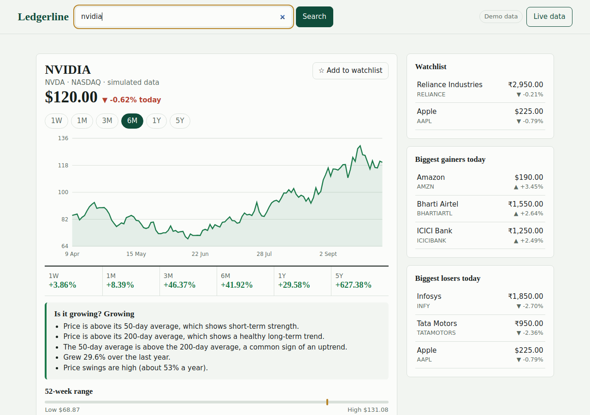
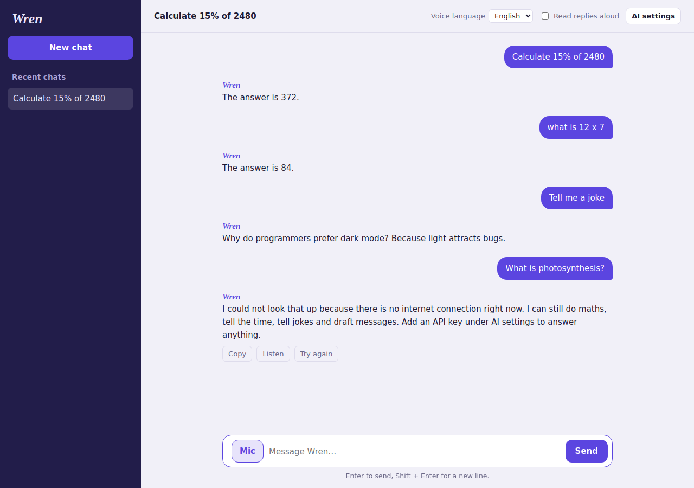
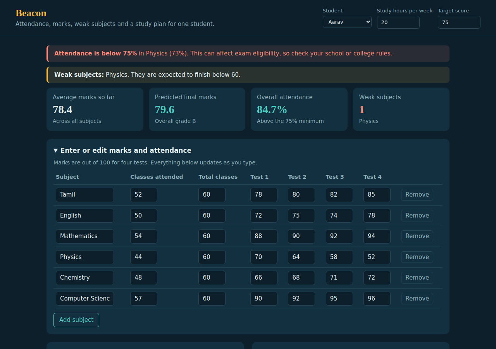

# UI Template Collection

A collection of modern web UI templates, built for the UI Template Collection Hackathon.

## Team
- Team name: _add your team name_
- Members: _add names and roles (UI developer, reviewer, tester, coordinator)_

## Selected UI topics
1. Financial Analytics
2. AI Assistant
3. AI Dashboard

## Topic research
Each folder has its own README that covers what the pattern is, where it is used, why it matters, what we observed and what our version does differently.

| UI | Folder | Short summary |
| --- | --- | --- |
| Financial Analytics | [financial-analytics](financial-analytics) | Company search, up or down price, growth by period, "is it growing?" verdict, watchlist |
| AI Assistant | [ai-assistant](ai-assistant) | Chat and voice assistant: maths, Wikipedia answers, optional full AI, read-aloud |
| AI Dashboard | [ai-dashboard](ai-dashboard) | Student dashboard: attendance, marks, weak subjects, predictions, study hours, notes |

## Implemented UIs
Each UI has `index.html`, `style.css`, `script.js` and a `README.md`.

## Technologies used
HTML, CSS and JavaScript only. No frameworks, libraries or build tools. Charts are drawn with SVG. The assistant uses the browser's Web Speech API for voice, and optional live data uses the Alpha Vantage and Anthropic APIs with your own keys.

## Screenshots
| Financial Analytics | AI Assistant | AI Dashboard |
| --- | --- | --- |
|  |  |  |

## Run the project
1. Download or clone the repository.
2. Open the `index.html` file inside any UI folder in a modern browser.
3. For voice input in the assistant, run a small local server from the project folder (`python -m http.server`) and open `http://localhost:8000/ai-assistant/` in Chrome or Edge.

## GitHub workflow
```
Fork -> Clone -> Branch -> Develop -> Commit -> Push -> Pull Request -> Review -> Merge
```

```bash
git clone https://github.com/<your-username>/<repository>.git
cd <repository>
git checkout -b feature/financial-analytics
git add financial-analytics
git commit -m "Add financial analytics dashboard"
git push origin feature/financial-analytics
```
Then open a Pull Request on GitHub and ask a teammate to review it before merging.

## Notes
Stock prices and student records are demo data created for the UI, and are not real market data or real students.
